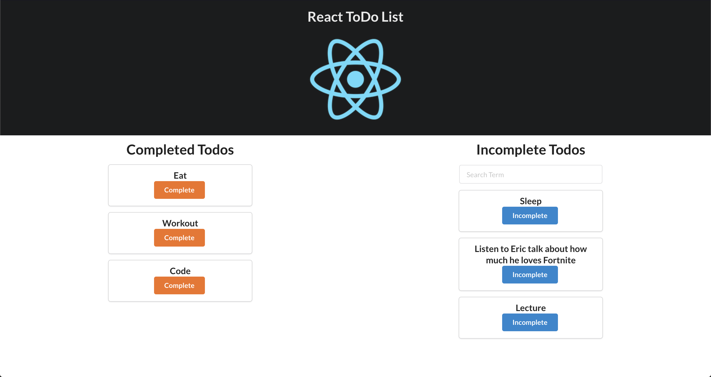

This project was bootstrapped with [Create React App](https://github.com/facebook/create-react-app).

# React ToDo List Lite

## Setup

Run `npm install`

To get you going, we've got a list with todos defined in App.js.

Let's run the app with `npm run start` or `npm start`

## Background

We have a React To Do List. We want the App to manage which ones are Completed and which ones are Incomplete (too lazy to keep track).
We will pass the list of todos and render each onto the page while organizing which ones go in the appropriate category. At the same time, we want to be able to change the completed status and have it render it the new category.

Ultimately, we want our App to look something like:

## Deliverables

* Pass the data from App.js stored in todosArr.
* Render each todo in the appropriate component.
* Each todo card will have button to change the complete status which will conditionally render based on the location of component. (i.e if a todo is under the Complete, the button text should say Incomplete and vice-versa.)
* Incorporate the SearchBarComponent within the Incomplete Component to filter out todos. As you type, the Incomplete todos are dynamically rendered. 

Here is a gif of what it's supposed to look:

### Bonus

* Add a delete button with each todo. When the todo is deleted, also remove from React.
